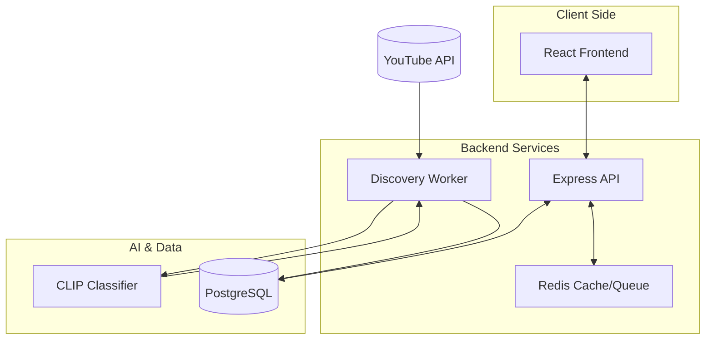

# Advanced Video Aggregation Platform

A high-performance, AI-powered video discovery and aggregation platform tailored for the Tamil Gaming community. Featuring real-time YouTube synchronization, CLIP-based computer vision classification, and an automated, balanced discovery engine.


## ✨ AI-Assisted Development

This project was developed using modern AI-assisted development workflows to accelerate prototyping and implementation. 
AI tools were used to support code generation and experimentation, while the system architecture, service integration, and core engineering decisions were designed and implemented by me.

The platform follows a microservice-based architecture integrating a Node.js API layer with a Python FastAPI AI inference service powered by Hugging Face Transformers.

## 🚀 Core Features

- **🎯 Precision Channel Discovery**: Strictly aggregate content from your favorite creators using YouTube Handles (`@tamilgaming`) or Channel IDs.
- **🧠 CLIP-Powered Classification**: Uses OpenAI's **CLIP (Contrastive Language-Image Pre-training)** to analyze video thumbnails and titles, ensuring 99.9% accurate genre categorization (Gaming, Anime, Reaction, Horror, etc.).
- **⚖️ Balanced Aggregation Engine**: Advanced round-robin discovery ensures an equal distribution of content across all tracked channels.
- **✨ Dynamic genre Extraction**: Automatically detects emerging games and topics from video tags and titles, promoting them to new sidebar categories in real-time.
- **📡 Live Stream Integration**: Real-time detection and broadcasting of live streams with instant UI updates via WebSockets.
- **⚡ Microservice Architecture**: Dockerized stack optimized for speed and scalability (Node.js, Python, PostgreSQL, Redis).

## 🛠 Tech Stack

- **Frontend**: React (Vite), CSS3 (Modern Glassmorphism), Lucide Icons.
- **Backend API**: Node.js, Express.js, BullMQ (Task Queue).
- **AI Microservice**: Python (FastAPI), PyTorch, HuggingFace Transformers (CLIP-ViT-B-32).
- **Data Stores**: 
    - **PostgreSQL**: Robust persistence for videos, genres, and logs.
    - **Redis**: High-speed caching and background job coordination.
- **Infrastructure**: Docker & Docker Compose.

## 🏁 Getting Started

### 1. Prerequisites
- [Docker & Docker Compose](https://www.docker.com/products/docker-desktop/) installed.
- A [YouTube Data API v3 Key](https://console.cloud.google.com/apis/library/youtube.googleapis.com).

### 2. Configuration
Create a `.env` file in the root directory (referencing `.env.example`):

```env
# YouTube API Access
YOUTUBE_API_KEY=your_api_key_here
CHANNEL_IDS=@tamilgaming,@TamilAnimeReacts

# Discovery Limits
YOUTUBE_MAX_RESULTS=500
POLL_INTERVAL_MS=3600000
```

### 3. Launch the Platform
```powershell
docker-compose up --build -d
```

Access the platform at `http://localhost:5173`.

## 🏗 Architecture Overview



## 📈 Advanced Functionality

### Dynamic Genre Discovery
The platform doesn't just use a fixed list of categories. If multiple videos share a recurring tag or title keyword (e.g., "Resident Evil"), the `GenreDiscoveryService` will:
1.  Auto-create a new `Horror` or specific game genre.
2.  Generate optimized semantic prompts for the AI model.
3.  Synchronize the new genre to the CLIP classifier without a restart.

### Balanced Discovery
By leveraging YouTube's **Uploads Playlist API**, the platform fetches content chronologically and interleaved. This guarantees that if you follow two channels, your homepage remains balanced and doesn't get dominated by a single high-frequency uploader.

## 🤝 Contributing
Feel free to fork this project and submit PRs for any improvements, especially around new CLIP prompt optimizations or frontend UI enhancements.

## 📄 License
MIT License — see the [LICENSE](LICENSE) file for details.
